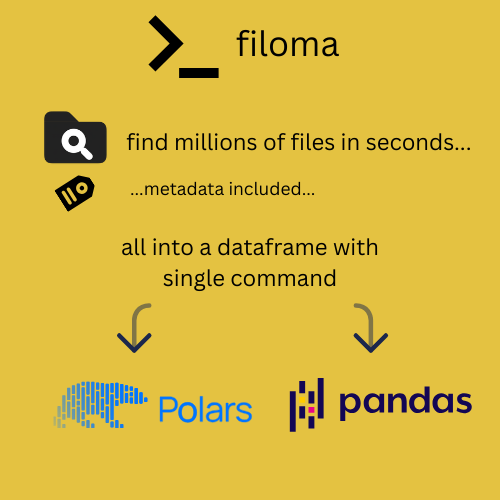
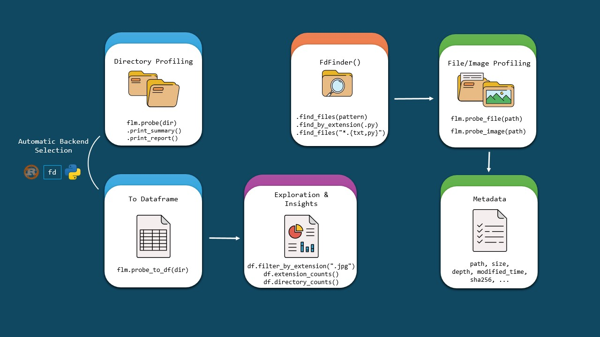

<p align="center">
    
</p>

<p align="center">
    <a href="https://pypi.python.org/pypi/filoma"></a>
    <a href="https://pypi.python.org/pypi/filoma"></a>
    <a href="https://github.com/kalfasyan/filoma/blob/main/LICENSE"></a>
    <a href="https://github.com/astral-sh/ruff"></a>
    <a href="https://github.com/kalfasyan/filoma/actions/workflows/ci.yml"></a>
    <a href="https://filoma.readthedocs.io/en/latest/"></a>
</p>

<p align="center">
  <strong>Fast, multi-backend file/directory profiling and data preparation.</strong>
</p>

<p align="center">
  <code>pip install filoma</code>
</p>

<p align="center">
  <code>import filoma as flm</code>
</p>

<p align="center">
  <a href="docs/getting-started/installation.md">Installation</a> •
  <a href="https://filoma.readthedocs.io/en/latest/">Documentation</a> •
  <a href="docs/guides/brain.md">Agentic Analysis</a> •
  <a href="docs/guides/cli.md">Interactive CLI</a> •
  <a href="docs/getting-started/quickstart.md">Quickstart</a> •
  <a href="docs/tutorials/cookbook.md">Cookbook</a> •
  <a href="https://github.com/kalfasyan/filoma/blob/main/notebooks/roboflow_demo.ipynb">Roboflow Dataset Demo</a> •
  <a href="https://github.com/kalfasyan/filoma">Source Code</a>
</p>

> 📖 **New to Filoma?** Check out the [**Cookbook**](docs/tutorials/cookbook.md) for practical, copy-paste recipes for common tasks!

---

`filoma` helps you analyze file directory trees, inspect file metadata, and prepare your data for exploration. It can achieve this blazingly fast using the best available backend (Rust, [`fd`](https://github.com/sharkdp/fd), or pure Python) ⚡🍃

<p align="center">
    
</p>

## Key Features

- **🚀 High-Performance Backends**: Automatic selection of Rust, `fd`, or Python for the best performance.
- **📈 DataFrame Integration**: Convert scan results to [Polars](https://github.com/pola-rs/polars) (or [pandas](https://github.com/pandas-dev/pandas)) DataFrames for powerful analysis.
- **📊 Rich Directory Analysis**: Get detailed statistics on file counts, extensions, sizes, and more.
- **🔍 Smart File Search**: Use regex and glob patterns to find files with `FdFinder`.
- **🖼️ File/Image Profiling**: Extract metadata and statistics from various file formats.
- **🛡️ Dataset Integrity & Quality**: Unified integrity checking for snapshots, manifests, and automated quality scans (corruption, duplicates, leakage, class balance). [📖 **Data Integrity Guide →**](docs/guides/data-integrity.md)
- **🧠 Agentic Analysis**: Natural language interface for file discovery, deduplication, and metadata inspection. [📖 **Brain Guide →**](docs/guides/brain.md)
- **🏗️ Architectural Clarity**: High-level visual flows for discovery and processing. [📖 **Architecture Documentation →**](docs/reference/architecture.md)
- **🖥️ Interactive CLI**: Beautiful terminal interface for filesystem exploration and DataFrame analysis [📖 **CLI Documentation →**](docs/guides/cli.md)

<p align="center">
    
</p>

---

## ⚡ Quick Start

`filoma` provides a unified API for all your filesystem analysis needs. Whether you're inspecting a single file or a million-file directory, it stays fast and intuitive.

### 1. Simple File & Image Profiling

Extract rich metadata and statistics from any file or image with a single call.

```python
import filoma as flm

# Profile any file
info = flm.probe_file("README.md")
print(info)
```

<details>
<summary><b>📄 See Metadata Output</b></summary>

```text
Filo(
    path=PosixPath('README.md'),
    size=12237,
    mode_str='-rw-rw-r--',
    owner='user',
    modified=datetime.datetime(2025, 12, 30, 22, 45, 53),
    is_file=True,
    ...
)
```

</details>

For images, `probe_image` automatically extracts shapes, types, and pixel statistics.

### 2. Blazingly Fast Directory Analysis

Scan entire directory trees in milliseconds. `filoma` automatically picks the fastest available backend (Rust → `fd` → Python).

```python
# Analyze a directory
analysis = flm.probe('.')

# Print a high-level summary
analysis.print_summary()
```

<details open>
<summary><b>📂 See Directory Summary Table</b></summary>

```text
 Directory Analysis: /project (🦀 Rust (Parallel)) - 0.60s
┏━━━━━━━━━━━━━━━━━━━━━━━━━━┳━━━━━━━━━━━━━━━━━━━━━━┓
┃ Metric                   ┃ Value                ┃
┡━━━━━━━━━━━━━━━━━━━━━━━━━━╇━━━━━━━━━━━━━━━━━━━━━━┩
│ Total Files              │ 57,225               │
│ Total Folders            │ 3,427                │
│ Total Size               │ 2,084.90 MB          │
│ Average Files per Folder │ 16.70                │
│ Maximum Depth            │ 14                   │
│ Empty Folders            │ 103                  │
│ Analysis Time            │ 0.60s                │
│ Processing Speed         │ 102,114 items/sec    │
└──────────────────────────┴──────────────────────┘
```

</details>

```python
# Or get a detailed report with extensions and folder stats
analysis.print_report()
```

<details>
<summary><b>📊 See Detailed Directory Report</b></summary>

```text
          File Extensions
┏━━━━━━━━━━━━┳━━━━━━━━┳━━━━━━━━━━━━┓
┃ Extension  ┃ Count  ┃ Percentage ┃
┡━━━━━━━━━━━━╇━━━━━━━━╇━━━━━━━━━━━━┩
│ .py        │ 240    │ 12.8%      │
│ .jpg       │ 1,204  │ 64.2%      │
│ .json      │ 431    │ 23.0%      │
│ .svg       │ 28,674 │ 50.1%      │
└────────────┴────────┴────────────┘

          Common Folder Names
┏━━━━━━━━━━━━━━━┳━━━━━━━━━━━━━┓
┃ Folder Name   ┃ Occurrences ┃
┡━━━━━━━━━━━━━━━╇━━━━━━━━━━━━━┩
│ src           │ 1           │
│ tests         │ 1           │
│ docs          │ 1           │
│ notebooks     │ 1           │
└───────────────┴─────────────┘

          Empty Folders (3 found)
┏━━━━━━━━━━━━━━━━━━━━━━━━━━━━━━━━━━━━━━━━━━━━┓
┃ Path                                       ┃
┡━━━━━━━━━━━━━━━━━━━━━━━━━━━━━━━━━━━━━━━━━━━━┩
│ /project/data/raw/empty_set_A              │
│ /project/logs/old/unused                   │
│ /project/temp/scratch                      │
└────────────────────────────────────────────┘
```

</details>

### 3. DataFrames & Enrichment

Convert scan results to Polars DataFrames for advanced analysis. Use `.enrich()` to instantly add path components, file stats, and hierarchy data.

```python
# Scan and get an enriched filoma.DataFrame (Polars)
df = flm.probe_to_df('src', enrich=True)

print(df.head(2))
```

<details open>
<summary><b>📊 See Enriched DataFrame Output</b></summary>

```text
filoma.DataFrame with 2 rows
shape: (2, 18)
┌───────────────────┬───────┬────────┬───────────────┬───┬─────────┬───────┬────────┬────────┐
│ path              ┆ depth ┆ parent ┆ name          ┆ … ┆ inode   ┆ nlink ┆ sha256 ┆ xattrs │
│ ---               ┆ ---   ┆ ---    ┆ ---           ┆   ┆ ---     ┆ ---   ┆ ---    ┆ ---    │
│ str               ┆ i64   ┆ str    ┆ str           ┆   ┆ i64     ┆ i64   ┆ str    ┆ str    │
╞═══════════════════╪═══════╪════════╪═══════════════╪═══╪═════════╪═══════╪════════╪════════╡
│ src/async_scan.rs ┆ 1     ┆ src    ┆ async_scan.rs ┆ … ┆ 7601121 ┆ 1     ┆ null   ┆ {}     │
│ src/filoma        ┆ 1     ┆ src    ┆ filoma        ┆ … ┆ 7603126 ┆ 8     ┆ null   ┆ {}     │
└───────────────────┴───────┴────────┴───────────────┴───┴─────────┴───────┴────────┴────────┘

✨ Enriched columns added: parent, name, stem, suffix, size_bytes, modified_time,
   created_time, is_file, is_dir, owner, group, mode_str, inode, nlink, sha256, xattrs, depth
```

</details>

- **Seamless Pandas Integration**: Just use `df.pandas` for instant conversion.
- **Lazy Loading**: `import filoma` is cheap; heavy dependencies load only when needed.

### 4. Specialized DataFrame Operations

Filoma's `DataFrame` extends Polars with specialized filesystem operations, providing quick ways to filter and summarize your data.

```python
# Filter by extensions
df.filter_by_extension([".py", ".rs"])

# Quick frequency analysis (counts)
df.extension_counts()
df.directory_counts()
```

<details>
<summary><b>🔍 See Operation Examples</b></summary>

**`filter_by_extension([".py", ".rs"])`**

```text
shape: (3, 1)
┌─────────────────────┐
│ path                │
│ ---                 │
│ str                 │
╞═════════════════════╡
│ src/async_scan.rs   │
│ src/lib.rs          │
│ src/filoma/dedup.py │
└─────────────────────┘
```

**`extension_counts()`**
_Groups files by extension and returns counts._

```text
shape: (3, 2)
┌────────────┬─────┐
│ extension  ┆ len │
│ ---        ┆ --- │
│ str        ┆ u32 │
╞════════════╪═════╡
│ .py        ┆ 240 │
│ .jpg       ┆ 124 │
│ .json      ┆ 43  │
└────────────┴─────┘
```

**`directory_counts()`**
_Summarizes file distribution across parent directories._

```text
shape: (3, 2)
┌────────────┬─────┐
│ parent_dir ┆ len │
│ ---        ┆ --- │
│ str        ┆ u32 │
╞════════════╪═════╡
│ src/filoma ┆ 12  │
│ tests      ┆ 8   │
│ docs       ┆ 5   │
└────────────┴─────┘
```

</details>

### 5. 🧠 Filoma Brain (Agentic Analysis)

Connect a "brain" to your filesystem. Filoma integrates with [PydanticAI](https://ai.pydantic.dev/) to allow you to interact with your files using natural language. The agent has tools to scan directories, find duplicates, and inspect metadata.

```python
from filoma.brain import get_agent

# "Find duplicate images in ./data and tell me how many groups you found"
agent = get_agent()
await agent.run("Find duplicate images...")
```

Or chat directly from the terminal:

```bash
filoma brain chat
```

[📖 **Read the Agentic Analysis Guide →**](docs/guides/brain.md)

### 6. 🛡️ Dataset Integrity & Quality

Filoma provides a comprehensive suite for dataset validation: perform snapshot/manifest integrity checks or deep content quality scans (corruption, leaks, balance).

```python
# 1. Integrity check (snapshot/manifest)
import filoma.core.verifier as vrf
vrf.verify_dataset("manifest.json", target_path="./data")

# 2. Deep quality analysis
from filoma.core.verifier import DatasetVerifier
verifier = DatasetVerifier("./data")
verifier.run_all()
verifier.print_summary()
```

[📖 **Data Integrity & Quality Guide →**](docs/guides/data-integrity.md) • 
[🖥️ **CLI Command**](docs/guides/cli.md)

## Deduplication

Filoma can find duplicate files, images (perceptual hash), or text files (shingle-based jaccard similarity).

```bash
# Standard find
filoma dedup /path/to/dataset

# Cross-directory find (compare two sets)
filoma dedup train/ valid/ --cross-dir
```

## Performance & Benchmarks

Need to compare backend performance? Check out the comprehensive [**Benchmarks Guide**](docs/reference/benchmarks.md)!

**Latest Results:**

- **Local SSD** (1M files, MacBook Air M4):
  - 🦀 **Rust**: 7.3s (136K files/sec) - fastest for metadata collection
  - ⚡ **Async**: 11.5s (87K files/sec) - strong alternative
  - 🐍 **Python**: 35.5s (28K files/sec) - reliable baseline
  - **os.walk** (discovery-only): 0.565s (1.77M files/sec)

- **Network Storage** (200k files, cold cache):
  - 🦀 **Rust**: 2.3s (86K files/sec)
  - ⚡ **Async**: 2.8s (70K files/sec)
  - 🐍 **Python**: 15.1s (13K files/sec)

The [Benchmarks Guide](docs/reference/benchmarks.md) includes:

- 📊 Detailed results across backends and storage types
- 🔧 Testing methodology and best practices
- 💡 Backend selection recommendations for your use case

Run your own benchmarks:

```bash
python benchmarks/benchmark.py --path /your/directory -n 3 --backend profiling
```

## License

Shield: [![CC BY 4.0][cc-by-shield]][cc-by]

This work is licensed under a
[Creative Commons Attribution 4.0 International License][cc-by].

[![CC BY 4.0][cc-by-image]][cc-by]

[cc-by]: http://creativecommons.org/licenses/by/4.0/
[cc-by-image]: https://i.creativecommons.org/l/by/4.0/88x31.png
[cc-by-shield]: https://img.shields.io/badge/License-CC%20BY%204.0-lightgrey.svg

## Contributing

Contributions welcome! Please check the [issues](https://github.com/filoma/filoma/issues) for planned features and bug reports.

---

**filoma** - Fast, multi-backend file/directory profiling and data preparation.
