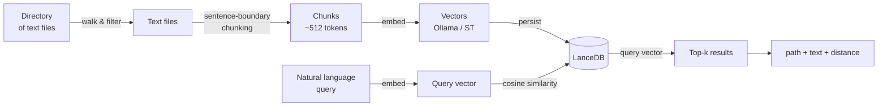
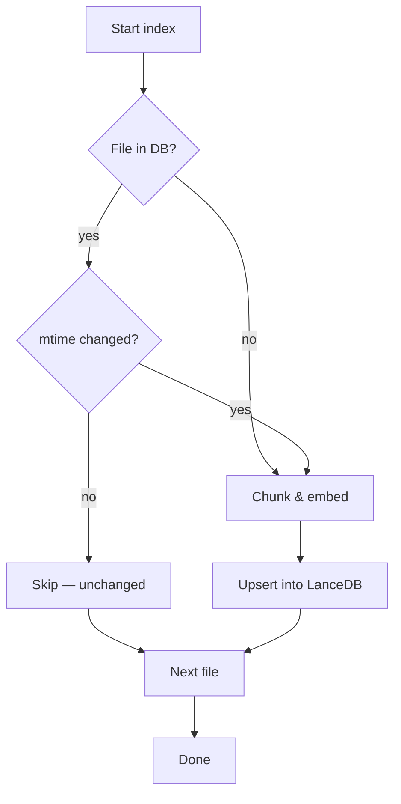
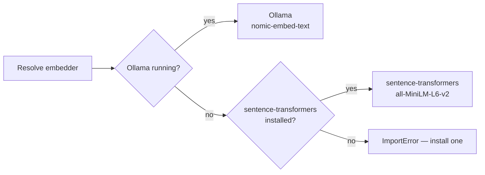

# Semantic Search (RAG)

filoma can index your text files into a local vector store and let you search them by **meaning**, not just by keyword. It's powered by [LanceDB](https://lancedb.github.io/lancedb/) — an embedded columnar vector database — no external services required.

## How it works



Each step:

1. **Walk** — scan the directory tree, pick up supported text files (`.md`, `.py`, `.json`, `.yaml`, `.rs`, `.js`, etc.)
2. **Chunk** — split each file at sentence boundaries into chunks of roughly 512 tokens
3. **Embed** — convert each chunk into a high-dimensional vector using the best available backend
4. **Store** — persist chunk + vector + metadata into a local LanceDB table
5. **Query** — embed your natural-language question, find the nearest chunks by cosine distance

### Incremental updates



Files are tracked by `(relative_path, mtime)` — only new or modified files are re-processed on subsequent `index()` calls.

## Embedding backends

The embedder is resolved in this order at runtime:



| Backend                   | How to enable                                                       | Notes                                 |
| ------------------------- | ------------------------------------------------------------------- | ------------------------------------- |
| Ollama `nomic-embed-text` | `ollama pull nomic-embed-text` and ensure Ollama is running locally | Zero internet after pull, GPU-capable |
| sentence-transformers     | `pip install filoma[rag]`                                           | ~100 MB model download first time     |

Environment variables (from `.env`): set `HF_TOKEN` to increase HuggingFace Hub rate limits when using sentence-transformers.

## Installation

```bash
pip install "filoma[rag]"
```

This brings in `lancedb`, `pyarrow`, and `sentence-transformers`. For the lighter Ollama path, you only need `lancedb` + `pyarrow`:

```bash
pip install lancedb pyarrow
ollama pull nomic-embed-text
```

## Usage

### Index a directory

```python
from filoma.core.rag import RagStore

store = RagStore(db_path="./my_index.lance")
count = store.index("./docs", pattern="*.md")
print(f"Indexed {count} chunks")
```

| Parameter   | Description                                     |
| ----------- | ----------------------------------------------- |
| `db_path`   | Filesystem path where LanceDB persists its data |
| `directory` | Root directory to scan recursively              |
| `pattern`   | Glob pattern to filter files (default `*`)      |

Returns the total number of chunks stored after the pass.

### Search

```python
results = store.search("how does the snapshot system work?", top_k=5)

for r in results:
    print(f"{r['path']} (chunk {r['chunk_idx']}, distance={r['_distance']:.4f})")
    print(f"  {r['text'][:200]}...")
    print()
```

| Key         | Description                              |
| ----------- | ---------------------------------------- |
| `path`      | Relative file path from the indexed root |
| `chunk_idx` | Zero-based chunk index within that file  |
| `text`      | The matched text chunk                   |
| `_distance` | Cosine distance (lower = more similar)   |

### Re-index (incremental)

```python
store.index("./docs", pattern="*.md")  # fast — skips unchanged files
```

### Session caching (via Filaraki agent)

When using `filoma ask`, the RAG store is cached on the agent session. Index once, query many times:

```bash
filoma ask "index the docs/ directory"
filoma ask "what are the quality gates?"         # uses cached index
filoma ask "how does snapshot verification work?" # same index, no re-walk
```

## Caching over probes

Currently, `RagStore` walks the filesystem independently of filoma's probe/scan layer. Letting a probe feed the file list directly into the RAG index would avoid a redundant traversal and unify the pipeline. This is tracked on the [adoption roadmap](../roadmap/adoption.md#phase-5--agentic-depth-xl).

## Full example

```python
import tempfile
from filoma.core.rag import RagStore

with tempfile.TemporaryDirectory() as db_dir:
    store = RagStore(db_path=db_dir)
    store.index("./docs", pattern="*.md")

    results = store.search("what are the quality gates?")
    for r in results:
        print(r["path"], "-", r["text"][:100])
```

## Limitations

- Embedding is CPU-bound unless using GPU-accelerated Ollama
- Chunking uses a simple sentence-boundary heuristic (~512 tokens per chunk); dense technical docs may benefit from pre-chunking
- Only text files are indexed — binary files (images, audio, etc.) are skipped
- Currently independent of filoma's probe/scan layer (see [Caching over probes](#caching-over-probes))
