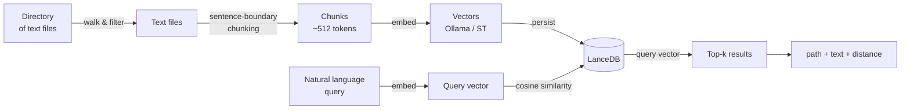
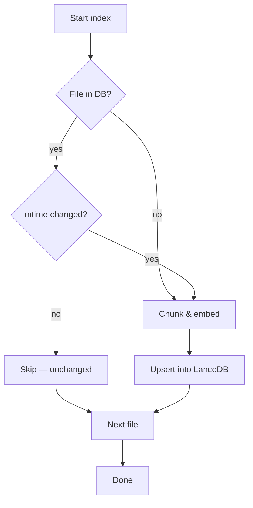
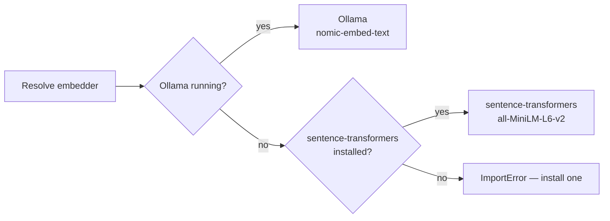

# Semantic Search (RAG)

filoma can index your text files into a local vector store and let you search them by **meaning**, not just by keyword. It's powered by [LanceDB](https://lancedb.github.io/lancedb/) — an embedded columnar vector database — no external services required.

## How it works



Each step:

1. **Walk** — scan the directory tree, pick up supported text files (`.md`, `.py`, `.json`, `.yaml`, `.rs`, `.js`, etc.)
2. **Chunk** — split each file at sentence boundaries into chunks of roughly 512 tokens
3. **Embed** — convert each chunk into a high-dimensional vector using the best available backend
4. **Store** — persist chunk + vector + metadata into a local LanceDB table
5. **Query** — embed your natural-language question, find the nearest chunks by cosine distance

### Incremental updates



Files are tracked by `(relative_path, mtime)` — only new or modified files are re-processed on subsequent `index()` calls.

## Embedding backends

The embedder is resolved in this order at runtime:



| Backend                   | How to enable                                                       | Notes                                 |
| ------------------------- | ------------------------------------------------------------------- | ------------------------------------- |
| Ollama `nomic-embed-text` | `ollama pull nomic-embed-text` and ensure Ollama is running locally | Zero internet after pull, GPU-capable |
| sentence-transformers     | `pip install filoma[rag]`                                           | ~100 MB model download first time     |

Environment variables (from `.env`): set `HF_TOKEN` to increase HuggingFace Hub rate limits when using sentence-transformers.

## Installation

```bash
pip install "filoma[rag]"
```

This brings in `lancedb`, `pyarrow`, and `sentence-transformers`. For the lighter Ollama path, you only need `lancedb` + `pyarrow`:

```bash
pip install lancedb pyarrow
ollama pull nomic-embed-text
```

## Usage

### Index a directory

```python
from filoma.core.rag import RagStore

store = RagStore(db_path="./my_index.lance")
count = store.index("./docs", pattern="*.md")
print(f"Indexed {count} chunks")
```

| Parameter   | Description                                     |
| ----------- | ----------------------------------------------- |
| `db_path`   | Filesystem path where LanceDB persists its data |
| `directory` | Root directory to scan recursively              |
| `pattern`   | Glob pattern to filter files (default `*`)      |

Returns the total number of chunks stored after the pass.

### Search

```python
results = store.search("how does the snapshot system work?", top_k=5)

for r in results:
    print(f"{r['path']} (chunk {r['chunk_idx']}, distance={r['_distance']:.4f})")
    print(f"  {r['text'][:200]}...")
    print()
```

| Key         | Description                              |
| ----------- | ---------------------------------------- |
| `path`      | Relative file path from the indexed root |
| `chunk_idx` | Zero-based chunk index within that file  |
| `text`      | The matched text chunk                   |
| `_distance` | Cosine distance (lower = more similar)   |

### Re-index (incremental)

```python
store.index("./docs", pattern="*.md")  # fast — skips unchanged files
```

### Session caching (via Filaraki agent)

When using `filoma ask`, the RAG store is cached on the agent session. Index once, query many times:

```bash
filoma ask "index the docs/ directory"
filoma ask "what are the quality gates?"         # uses cached index
filoma ask "how does snapshot verification work?" # same index, no re-walk
```

## Caching over probes

Currently, `RagStore` walks the filesystem independently of filoma's probe/scan layer. Letting a probe feed the file list directly into the RAG index would avoid a redundant traversal and unify the pipeline. This is tracked on the [adoption roadmap](../roadmap/adoption.md#phase-5--agentic-depth-xl).

## Embeddings on the DataFrame

`RagStore` is great for one-off natural-language queries ("what does this file say?"), but sometimes you want the *file table itself* to know which files are related by content — not just by folder or filename. `DataFrame.add_embedding_cols()` and `DataFrame.add_semantic_similarity_cols()` bring the same embedding backend into the Polars-backed `filoma.DataFrame`, so relationships between files become plain columns you can filter, sort, or group on.

```python
import filoma as flm

df = flm.probe("./docs").df  # or any DataFrame with a "path" column
df = df.add_embedding_cols()               # adds an `embedding` list[float] column
df = df.add_semantic_similarity_cols(top_k=3)  # adds nearest-neighbor columns

print(df.polars().select("path", "nearest_neighbor_paths", "nearest_neighbor_similarities"))
```

| Method                         | Adds                                                            |
| ------------------------------ | ---------------------------------------------------------------- |
| `add_embedding_cols()`         | `embedding` (`list[float]` per row; null for non-text/unreadable files) |
| `add_metadata_embedding_cols()` | `metadata_embedding` (`list[float]` per row, built from structured columns) |
| `add_semantic_similarity_cols()` | `nearest_neighbor_paths`, `nearest_neighbor_similarities` (`list` per row, most similar first) |

Notes:

- `add_embedding_cols()` embeds only the first `max_chars` (default 4000) of each file's content — enough for a good topical fingerprint without re-reading huge files.
- `add_semantic_similarity_cols()` computes cosine similarity across all embedded rows (O(n²)); it's intended for per-folder/per-dataset analysis (hundreds–low thousands of files), not whole-filesystem scans.
- Use cases: surfacing near-duplicate documentation, grouping dataset files by topic instead of directory structure, or flagging a file that's semantically an outlier in its folder.
- This does not (yet) share a LanceDB table with `RagStore` — each call recomputes embeddings in-memory. Unifying the two into one persisted store is tracked alongside the [Caching over probes](#caching-over-probes) item.
- Both methods are also exposed as agent tools — `add_embedding_cols` and `add_semantic_similarity_cols` — available via `filoma ask`/`filoma chat` (Filaraki) and the MCP server (`filoma mcp serve`), operating on the DataFrame currently loaded in that session.

### Fusing metadata with content similarity

Content embeddings only look at what's *inside* a file — they ignore everything already sitting in the DataFrame (size, extension, owner, timestamps). `DataFrame.add_metadata_embedding_cols()` turns those structured columns into a second, "uninterpretable" numeric feature vector per row, so metadata can contribute to similarity too:

```python
df = df.add_file_stats_cols()              # populates size_bytes, owner, modified_time, ...
df = df.add_embedding_cols()               # content embedding
df = df.add_metadata_embedding_cols()      # metadata embedding, from size/suffix/owner/timestamps/...

df = df.add_semantic_similarity_cols(
    metadata_embedding_col="metadata_embedding",
    content_weight=0.6,  # 60% content similarity, 40% metadata similarity
)
```

How it works:

- Numeric columns (`size_bytes`, `depth`) are `log1p`-scaled (for size) and min-max normalized.
- Timestamp columns (`modified_time`, `created_time`) are parsed to epoch seconds and min-max normalized.
- Categorical columns (`suffix`, `owner`, `group`, `is_dir`) are one-hot encoded, capped at `max_categories` (default 20) with long-tail values bucketed into `"_other"`.
- Auto-detects which of these columns are present — call `add_file_stats_cols()` first to populate them, or pass an explicit `columns=[...]` list to `add_metadata_embedding_cols()`.
- When `metadata_embedding_col` is passed to `add_semantic_similarity_cols()`, similarity is a weighted blend (`content_weight` for content, `1 - content_weight` for metadata) computed only where both rows in a pair have a metadata embedding; otherwise it falls back to content-only similarity for that pair.
- Also exposed as the `add_metadata_embedding_cols` agent/MCP tool, and `add_semantic_similarity_cols` accepts the same `metadata_embedding_col`/`content_weight` parameters there.

### Safety limit on whole-repo DataFrames (agent tools only)

Embedding is CPU/model-bound and much slower per file than a stat or hash call — a DataFrame built from `create_dataset_dataframe(".")` on a real project can include tens of thousands of files once `.venv/`, `target/`, `node_modules/`, and `.git/` are swept in. To avoid an agent session silently trying to embed all of them, the **`add_embedding_cols` tool** (not the raw `DataFrame` method — that stays unrestricted for direct Python use) refuses when more than 500 files in the DataFrame look embeddable, and reports the count instead of running:

```text
⚠️ This DataFrame has 34,167 files that look embeddable, which exceeds the safety limit
of 500 ... Narrow it first with filter_by_extension() / filter_by_pattern(), or re-run
with ignore_safety_limits=True to embed anyway.
```

Narrow the DataFrame first (e.g. `filter_by_extension(".md")`, `filter_by_pattern(r"^docs/")`), or pass `ignore_safety_limits=True` if you really want to embed everything.

## Full example

```python
import tempfile
from filoma.core.rag import RagStore

with tempfile.TemporaryDirectory() as db_dir:
    store = RagStore(db_path=db_dir)
    store.index("./docs", pattern="*.md")

    results = store.search("what are the quality gates?")
    for r in results:
        print(r["path"], "-", r["text"][:100])
```

## Limitations

- Embedding is CPU-bound unless using GPU-accelerated Ollama
- Chunking uses a simple sentence-boundary heuristic (~512 tokens per chunk); dense technical docs may benefit from pre-chunking
- Only text files are indexed — binary files (images, audio, etc.) are skipped
- Currently independent of filoma's probe/scan layer (see [Caching over probes](#caching-over-probes))
