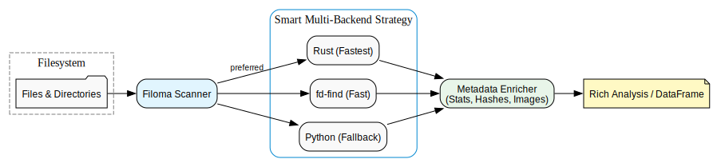
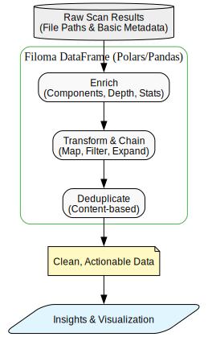

# Filoma Architecture

Filoma is built to solve two main challenges: blazingly fast filesystem discovery and seamless data preparation for analysis.

## 1. High-Speed Discovery & Profiling

The primary goal of Filoma is to scan massive directory trees and extract metadata as quickly as possible. It achieves this by automatically selecting the best available backend for your system, preferring high-performance Rust or the `fd` utility over pure Python.



_Intuition: Filoma acts as a smart orchestrator that picks the fastest path to your data, enriching it with deep metadata (like hashes or image stats) along the way._

DOT source: `docs/diagrams/profiling-flow.dot`.

### Backend selection — the canonical extension point

Filoma resolves a backend at runtime via a fixed priority chain:

| Priority | Backend | Condition                           |
| -------- | ------- | ----------------------------------- |
| 1        | Rust    | Rust extension installed (maturing) |
| 2        | `fd`    | `fd-find` available on `$PATH`      |
| 3        | Python  | Always available (pure stdlib walk) |

This is the **canonical extension pattern** for the codebase. The
caller (`DirectoryProfiler`) depends on a `Probe` / `Scanner`
abstraction — never on a concrete backend. A new backend only needs
to implement the same protocol and register itself in the selection
logic.

To add a new backend (e.g. a hypothetical S3 scanner):

1. Implement the `scan` protocol returning the same item tuples the
   existing backends produce.
2. Register its availability check in `DirectoryProfiler._choose_backend`.
3. Add a `search_backend` option so callers can opt in.

The key constraint: the protocol is not formalised as an ABC today.
Contributors should follow the existing `fd` backend as the
reference implementation in `src/filoma/directories/` — it shows
the exact item signature, error handling, and fallback conventions
expected by the `DirectoryProfiler` orchestrator.

See `src/filoma/directories/directory_profiler.py:530` for the
current selection logic.

---

## 2. Intuitive Data Preparation

Once discovered, Filoma turns raw filesystem metadata into a powerful `filoma.DataFrame`. This layer allows you to treat your filesystem like a database, enabling easy enrichment, chaining of operations, and content-based deduplication.



_Intuition: Filoma bridges the gap between raw files and actionable insights, providing a clean API to transform, filter, and deduplicate your data for downstream use._

DOT source: `docs/diagrams/data-processing.dot`.

Render both diagrams locally with Graphviz. Example commands:

```bash
# install graphviz on macOS (if needed)
brew install graphviz

# render profiling flow
dot -Tsvg docs/diagrams/profiling-flow.dot -o docs/assets/images/profiling-flow.svg

# render data processing flow
dot -Tsvg docs/diagrams/data-processing.dot -o docs/assets/images/data-processing.svg
```
